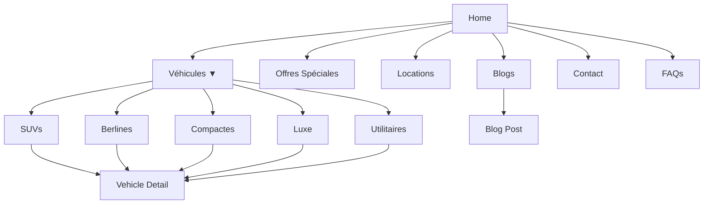
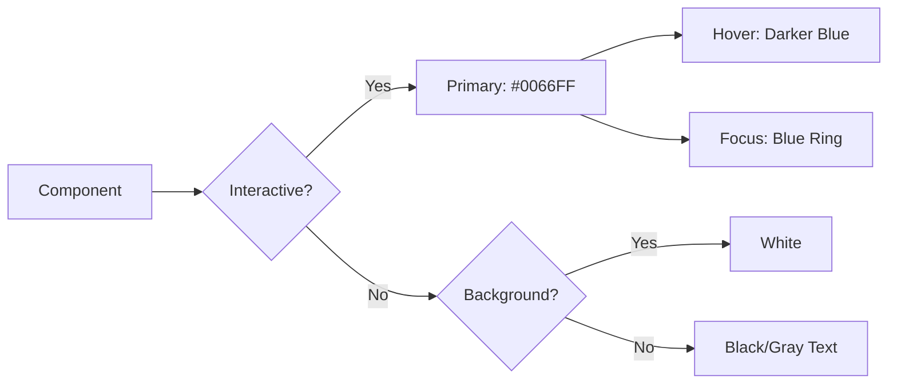

# Design Document

## Overview

This design document outlines the comprehensive redesign of the DadaRentCar website to establish a cohesive blue and white brand identity throughout all pages. The redesign transforms the current neubrutalist black/yellow theme into a modern, clean, and professional blue/white aesthetic while maintaining the existing Next.js 14 architecture with TypeScript, Tailwind CSS, and Framer Motion for animations.

### Current State Analysis

The website currently uses:
- **Color Scheme**: Black, white, and yellow (neubrutalist theme)
- **Framework**: Next.js 14 with App Router
- **Styling**: Tailwind CSS with custom CSS variables
- **Typography**: Montserrat font family
- **Components**: React Server Components with client-side interactivity
- **Animations**: Framer Motion for transitions
- **Navigation**: Basic navigation without dropdown functionality

### Target State

The redesigned website will feature:
- **Color Scheme**: Blue (#0066FF primary) and white
- **Enhanced Navigation**: Dropdown menu for vehicle categories, new Blogs and Locations sections
- **Improved Layouts**: Alternating image-text patterns on home page
- **Better Spacing**: Increased padding and margins, especially in FAQs
- **Consistent Branding**: Blue accents throughout all pages
- **French Language**: All content in French

## Architecture

### Component Structure

```
src/
├── app/
│   ├── layout.tsx (Global layout with Navbar & Footer)
│   ├── page.tsx (Home page)
│   ├── contact/page.tsx (Contact page)
│   ├── special-offers/page.tsx (Special offers page)
│   ├── vehicles/
│   │   ├── page.tsx (All vehicles)
│   │   ├── [category]/page.tsx (Category-specific pages)
│   │   └── [id]/page.tsx (Vehicle detail)
│   ├── locations/page.tsx (NEW - Locations page)
│   ├── blogs/
│   │   ├── page.tsx (NEW - Blog listing)
│   │   └── [slug]/page.tsx (NEW - Blog post)
│   └── globals.css (Updated color scheme)
├── components/
│   ├── navbar.tsx (Enhanced with dropdown)
│   ├── navbar-dropdown.tsx (NEW - Vehicle categories dropdown)
│   ├── hero-section.tsx (Updated colors)
│   ├── faq-section.tsx (Improved spacing)
│   ├── footer.tsx (Updated colors)
│   ├── home-content-section.tsx (NEW - Alternating layout)
│   └── ui/ (Shadcn components)
└── lib/
    └── constants.ts (NEW - Brand colors and categories)
```

### Routing Strategy

The application uses Next.js App Router with the following structure:

- `/` - Home page with hero, alternating content sections, featured cars, FAQs
- `/vehicles` - All vehicles listing
- `/vehicles/[category]` - Category-specific vehicle pages (suvs, berlines, compactes, luxe, utilitaires)
- `/vehicles/[id]` - Individual vehicle detail pages
- `/special-offers` - Special offers and promotions
- `/contact` - Contact form and information
- `/locations` - NEW: Rental locations and pickup points
- `/blogs` - NEW: Blog listing page
- `/blogs/[slug]` - NEW: Individual blog posts

## Components and Interfaces

### 1. Enhanced Navigation Bar

**Component**: `navbar.tsx` and `navbar-dropdown.tsx`

**Design Specifications**:
- **Background**: White (`bg-white`)
- **Border**: Subtle shadow (`shadow-sm`)
- **Logo**: Left-aligned with Tunisia flag emoji
- **Menu Items**: Blue hover states (`hover:text-[#0066FF]`)
- **Dropdown Trigger**: "Véhicules" with chevron-down icon
- **Call-to-Action**: Blue button (`bg-[#0066FF]`)

**Dropdown Menu Design**:
```typescript
interface VehicleCategory {
  id: string;
  label: string;
  route: string;
  icon?: React.ReactNode;
}

const categories: VehicleCategory[] = [
  { id: 'suvs', label: 'SUVs', route: '/vehicles/suvs' },
  { id: 'berlines', label: 'Berlines', route: '/vehicles/berlines' },
  { id: 'compactes', label: 'Compactes', route: '/vehicles/compactes' },
  { id: 'luxe', label: 'Luxe', route: '/vehicles/luxe' },
  { id: 'utilitaires', label: 'Utilitaires', route: '/vehicles/utilitaires' },
];
```

**Dropdown Styling**:
- **Background**: Blue (`bg-[#0066FF]`)
- **Text**: White (`text-white`)
- **Hover State**: Lighter blue or white background with blue text
- **Animation**: Smooth slide-down with Framer Motion
- **Mobile**: Accordion-style expansion

**Desktop Navigation Structure**:
```
[Logo] | Accueil | Véhicules ▼ | Offres Spéciales | Locations | Blogs | Contact | FAQs | [APPELEZ Button]
```

**Mobile Navigation**:
- Hamburger menu icon
- Full-screen overlay menu
- Expandable accordion for Véhicules submenu
- Blue accent colors throughout

### 2. Home Page Redesign

**Component**: `page.tsx` with new `home-content-section.tsx`

**Layout Pattern**:
```
[Hero Section - Full width with carousel]
[Brand Filter - Existing component with blue accents]
[Content Section 1 - Image Left, Text Right]
[Content Section 2 - Text Left, Image Right]
[Content Section 3 - Image Left, Text Right]
[Featured Cars - Existing component]
[FAQ Section - Improved spacing]
```

**Content Section Interface**:
```typescript
interface ContentSection {
  id: string;
  title: string;
  subtitle?: string;
  description: string;
  image: string;
  imagePosition: 'left' | 'right';
  ctaText?: string;
  ctaLink?: string;
}
```

**Content Section Design**:
- **Container**: Max-width 7xl, centered
- **Grid**: 2-column grid on desktop, single column on mobile
- **Image**: High-quality, aspect-ratio 16:9 or 4:3
- **Text**: 
  - Title: 3xl-4xl font-bold, black color
  - Subtitle: xl font-semibold, blue color
  - Description: lg text-gray-700, line-height 1.8
- **Spacing**: 24px minimum between sections
- **CTA Button**: Blue background, white text, hover effects

### 3. Hero Section Updates

**Component**: `hero-section.tsx`

**Color Changes**:
- **Primary Text**: Keep white for contrast
- **Accent Text**: Change from yellow to blue (`text-[#0066FF]`)
- **CTA Button**: Blue background (`bg-[#0066FF]`), white text
- **Button Hover**: White background with blue text
- **Border**: Keep black for contrast (4px solid)
- **Shadow**: Brutalist shadow with black

**Carousel Indicators**:
- Active: Blue (`bg-[#0066FF]`)
- Inactive: White with opacity (`bg-white/50`)

### 4. FAQ Section Improvements

**Component**: `faq-section.tsx`

**Spacing Updates**:
- **Container Padding**: `py-20` (80px vertical)
- **Item Spacing**: `space-y-6` (24px between items)
- **Item Padding**: `p-6` (24px internal padding)
- **Answer Padding**: `px-6 pb-6` (24px horizontal, 24px bottom)
- **Line Height**: `leading-relaxed` (1.625)

**Color Changes**:
- **Background**: Change from black to white
- **Item Background**: Light blue (`bg-blue-50`)
- **Border**: Blue border (`border-2 border-[#0066FF]`)
- **Question Text**: Black (`text-black`)
- **Number**: Blue (`text-[#0066FF]`)
- **Icon**: Blue (`text-[#0066FF]`)
- **Answer Text**: Dark gray (`text-gray-700`)
- **Hover State**: Slightly darker blue background (`hover:bg-blue-100`)

**Layout**:
```
┌─────────────────────────────────────────┐
│  [#] Question text                    ▼ │ ← 24px padding
├─────────────────────────────────────────┤
│  Answer text with comfortable spacing   │
│  Line height 1.625 for readability      │
└─────────────────────────────────────────┘
      ↕ 24px spacing
┌─────────────────────────────────────────┐
│  [#] Question text                    ▼ │
└─────────────────────────────────────────┘
```

### 5. Contact Page Modernization

**Component**: `contact/page.tsx`

**Color Replacements**:
- **Yellow Elements** → **Blue**:
  - Phone icon background: `bg-blue-100` with `text-[#0066FF]`
  - Submit button: `bg-[#0066FF]` with `text-white`
  - Focus rings: `focus:ring-[#0066FF]`
  - Links: `text-[#0066FF]`

**Header Section**:
- **Background**: Blue gradient (`bg-gradient-to-r from-[#0066FF] to-blue-400`)
- **Text**: White

**Contact Cards**:
- **Background**: White with shadow
- **Icon Backgrounds**: 
  - Phone: Light blue (`bg-blue-100`)
  - WhatsApp: Keep green (brand color)
  - Email: Light blue (`bg-blue-100`)
  - Location: Light blue (`bg-blue-100`)
  - Clock: Light blue (`bg-blue-100`)

**Form Styling**:
- **Input Borders**: Gray with blue focus ring
- **Focus State**: `focus:ring-2 focus:ring-[#0066FF]`
- **Submit Button**: Blue with white text, hover to darker blue
- **Success Message**: Keep green (positive feedback)

### 6. Special Offers Page Redesign

**Component**: `special-offers/page.tsx`

**Color Changes**:
- **Header Background**: Blue gradient (`bg-gradient-to-r from-[#0066FF] to-blue-400`)
- **Promotion Cards**: Keep gradient colors (green, blue, purple) for visual variety
- **CTA Buttons**: Blue (`bg-[#0066FF]`)
- **Accent Elements**: Blue instead of yellow

**Layout Consistency**:
- Match spacing and typography with other pages
- Use consistent card shadows and borders
- Ensure blue is the primary accent color

### 7. New Pages

#### Locations Page

**Route**: `/locations/page.tsx`

**Purpose**: Display rental locations, pickup/dropoff points, and service areas

**Design**:
- Hero section with blue gradient
- Map integration showing locations
- Location cards with:
  - Address
  - Phone number
  - Operating hours
  - Available services
- Blue accent colors throughout

#### Blogs Section

**Routes**: 
- `/blogs/page.tsx` - Blog listing
- `/blogs/[slug]/page.tsx` - Individual blog post

**Purpose**: Content marketing, SEO, customer engagement

**Design**:
- Blog listing: Grid of blog cards
- Blog post: Clean reading experience
- Categories and tags with blue accents
- Author information
- Related posts section

## Data Models

### Vehicle Category Model

```typescript
interface VehicleCategory {
  id: string;
  name: string;
  slug: string;
  description: string;
  icon?: string;
  displayOrder: number;
}

const vehicleCategories: VehicleCategory[] = [
  {
    id: '1',
    name: 'SUVs',
    slug: 'suvs',
    description: 'Véhicules utilitaires sport pour tous terrains',
    displayOrder: 1
  },
  {
    id: '2',
    name: 'Berlines',
    slug: 'berlines',
    description: 'Voitures élégantes pour le confort urbain',
    displayOrder: 2
  },
  {
    id: '3',
    name: 'Compactes',
    slug: 'compactes',
    description: 'Voitures économiques et pratiques',
    displayOrder: 3
  },
  {
    id: '4',
    name: 'Luxe',
    slug: 'luxe',
    description: 'Véhicules premium haut de gamme',
    displayOrder: 4
  },
  {
    id: '5',
    name: 'Utilitaires',
    slug: 'utilitaires',
    description: 'Véhicules pour le transport et le travail',
    displayOrder: 5
  }
];
```

### Home Content Section Model

```typescript
interface HomeContentSection {
  id: string;
  title: string;
  subtitle?: string;
  description: string;
  image: string;
  imageAlt: string;
  imagePosition: 'left' | 'right';
  ctaText?: string;
  ctaLink?: string;
  displayOrder: number;
}

const homeContentSections: HomeContentSection[] = [
  {
    id: '1',
    title: 'Votre Partenaire de Confiance',
    subtitle: 'Location de Véhicules en Tunisie',
    description: 'Depuis plus de 10 ans, nous offrons des services de location de véhicules de qualité supérieure...',
    image: '/images/about-us.jpg',
    imageAlt: 'Notre équipe professionnelle',
    imagePosition: 'left',
    ctaText: 'En Savoir Plus',
    ctaLink: '/about',
    displayOrder: 1
  },
  // Additional sections...
];
```

### Blog Post Model

```typescript
interface BlogPost {
  id: string;
  slug: string;
  title: string;
  excerpt: string;
  content: string;
  author: string;
  publishedAt: Date;
  updatedAt?: Date;
  featuredImage: string;
  category: string;
  tags: string[];
  status: 'draft' | 'published';
}
```

### Location Model

```typescript
interface RentalLocation {
  id: string;
  name: string;
  address: string;
  city: string;
  phone: string;
  email: string;
  coordinates: {
    lat: number;
    lng: number;
  };
  operatingHours: {
    [key: string]: { open: string; close: string };
  };
  services: string[];
  isMainOffice: boolean;
}
```

## Design System

### Color Palette

```typescript
// Brand Colors
const colors = {
  primary: {
    DEFAULT: '#0066FF',  // Main blue
    50: '#E6F0FF',
    100: '#CCE0FF',
    200: '#99C2FF',
    300: '#66A3FF',
    400: '#3385FF',
    500: '#0066FF',      // Primary
    600: '#0052CC',
    700: '#003D99',
    800: '#002966',
    900: '#001433',
  },
  white: '#FFFFFF',
  black: '#000000',
  gray: {
    50: '#F9FAFB',
    100: '#F3F4F6',
    200: '#E5E7EB',
    300: '#D1D5DB',
    400: '#9CA3AF',
    500: '#6B7280',
    600: '#4B5563',
    700: '#374151',
    800: '#1F2937',
    900: '#111827',
  },
};
```

### Typography Scale

```typescript
const typography = {
  fontFamily: {
    sans: ['Montserrat', 'sans-serif'],
  },
  fontSize: {
    xs: '0.75rem',      // 12px
    sm: '0.875rem',     // 14px
    base: '1rem',       // 16px - Minimum for body text
    lg: '1.125rem',     // 18px
    xl: '1.25rem',      // 20px
    '2xl': '1.5rem',    // 24px
    '3xl': '1.875rem',  // 30px
    '4xl': '2.25rem',   // 36px
    '5xl': '3rem',      // 48px
    '6xl': '3.75rem',   // 60px
    '7xl': '4.5rem',    // 72px
    '8xl': '6rem',      // 96px
  },
  lineHeight: {
    tight: '1.25',
    normal: '1.5',
    relaxed: '1.625',   // For FAQ answers
    loose: '1.8',       // For content sections
  },
};
```

### Spacing System

```typescript
const spacing = {
  section: {
    py: '5rem',         // 80px vertical padding for sections
    gap: '1.5rem',      // 24px minimum between major elements
  },
  faq: {
    itemGap: '1.5rem',  // 24px between FAQ items
    itemPadding: '1.5rem', // 24px internal padding
  },
  content: {
    maxWidth: '80rem',  // 1280px max width for content
    padding: '1rem',    // 16px base padding
  },
};
```

### Component Patterns

#### Button Styles

```typescript
const buttonStyles = {
  primary: 'bg-[#0066FF] text-white hover:bg-blue-600 px-6 py-3 font-semibold rounded-lg transition-colors',
  secondary: 'bg-white text-[#0066FF] border-2 border-[#0066FF] hover:bg-blue-50 px-6 py-3 font-semibold rounded-lg transition-colors',
  outline: 'border-2 border-[#0066FF] text-[#0066FF] hover:bg-[#0066FF] hover:text-white px-6 py-3 font-semibold rounded-lg transition-colors',
};
```

#### Card Styles

```typescript
const cardStyles = {
  default: 'bg-white rounded-xl shadow-md p-6 hover:shadow-lg transition-shadow',
  bordered: 'bg-white rounded-xl border-2 border-blue-100 p-6 hover:border-[#0066FF] transition-colors',
  elevated: 'bg-white rounded-xl shadow-lg p-8',
};
```

## Error Handling

### Navigation Errors

**Scenario**: Dropdown menu fails to load categories

**Handling**:
- Display fallback static links
- Log error to console
- Show user-friendly message if critical

**Implementation**:
```typescript
try {
  const categories = await fetchVehicleCategories();
  return categories;
} catch (error) {
  console.error('Failed to load vehicle categories:', error);
  return DEFAULT_CATEGORIES; // Fallback to static list
}
```

### Image Loading Errors

**Scenario**: Content section images fail to load

**Handling**:
- Use Next.js Image component with placeholder
- Provide fallback images
- Blur placeholder while loading

**Implementation**:
```typescript
<Image
  src={section.image}
  alt={section.imageAlt}
  fill
  className="object-cover"
  placeholder="blur"
  blurDataURL="/images/placeholder.jpg"
  onError={(e) => {
    e.currentTarget.src = '/images/fallback.jpg';
  }}
/>
```

### Form Submission Errors

**Scenario**: Contact form submission fails

**Handling**:
- Display error message in French
- Preserve form data
- Provide retry option
- Offer alternative contact methods

**Implementation**:
```typescript
try {
  await submitContactForm(formData);
  setSuccess(true);
} catch (error) {
  setError('Une erreur est survenue. Veuillez réessayer ou nous contacter par téléphone.');
  // Keep form data intact
}
```

### Route Not Found

**Scenario**: User navigates to non-existent vehicle category

**Handling**:
- Custom 404 page in French
- Suggest valid categories
- Provide search functionality
- Link back to main vehicles page

## Testing Strategy

### Component Testing

**Tools**: Jest, React Testing Library

**Test Cases**:

1. **Navbar Component**
   - Renders all menu items correctly
   - Dropdown opens on hover/click
   - Dropdown closes on outside click
   - Mobile menu toggles correctly
   - All links navigate to correct routes
   - Blue color scheme applied correctly

2. **FAQ Section**
   - All FAQs render with correct spacing
   - Accordion expands/collapses correctly
   - Blue accent colors applied
   - Line height meets requirements (1.6-1.8)
   - Minimum 24px spacing between items

3. **Contact Form**
   - All fields validate correctly
   - Form submits successfully
   - Error messages display in French
   - Blue styling applied to all elements
   - Success message displays correctly

4. **Home Content Sections**
   - Alternating layout renders correctly
   - Images load with proper aspect ratios
   - Text content displays with correct spacing
   - CTA buttons link correctly
   - Responsive on all screen sizes

### Integration Testing

**Test Cases**:

1. **Navigation Flow**
   - User can navigate from home to vehicle category
   - Dropdown menu works across all pages
   - Back navigation maintains state
   - Mobile navigation works correctly

2. **Color Consistency**
   - Blue color (#0066FF) used consistently
   - No yellow elements remain
   - White backgrounds throughout
   - Hover states use correct blue shades

3. **Responsive Design**
   - All pages render correctly on mobile (< 768px)
   - Tablet view works correctly (768px - 1024px)
   - Desktop view optimal (> 1024px)
   - Touch targets minimum 44px on mobile

### Visual Regression Testing

**Tools**: Percy, Chromatic, or manual testing

**Test Cases**:
- Screenshot comparison of all pages
- Verify color scheme changes
- Check spacing improvements
- Validate typography consistency
- Ensure responsive layouts

### Accessibility Testing

**Tools**: axe DevTools, Lighthouse

**Test Cases**:
- Color contrast ratios meet WCAG AA standards
- Keyboard navigation works throughout
- Screen reader compatibility
- Focus indicators visible
- ARIA labels present where needed

### Performance Testing

**Metrics**:
- Largest Contentful Paint (LCP) < 2.5s
- First Input Delay (FID) < 100ms
- Cumulative Layout Shift (CLS) < 0.1
- Time to Interactive (TTI) < 3.5s

**Optimization Strategies**:
- Image optimization with Next.js Image
- Code splitting for route-based chunks
- Lazy loading for below-fold content
- CSS optimization (remove unused styles)
- Font optimization (preload, subset)

## Migration Strategy

### Phase 1: Global Styles Update
1. Update `globals.css` with new blue color scheme
2. Replace CSS variables for primary colors
3. Update Tailwind configuration if needed
4. Test color changes across all pages

### Phase 2: Navigation Enhancement
1. Create dropdown component
2. Update navbar with new menu items
3. Implement vehicle category routing
4. Add Blogs and Locations to navigation
5. Test navigation on all devices

### Phase 3: Page-by-Page Updates
1. Home page: Add content sections
2. FAQ section: Improve spacing
3. Contact page: Replace yellow with blue
4. Special Offers: Update color scheme
5. Create new Locations page
6. Create new Blogs section

### Phase 4: Testing & Refinement
1. Visual regression testing
2. Accessibility audit
3. Performance optimization
4. User acceptance testing
5. Bug fixes and refinements

## Responsive Design Breakpoints

```typescript
const breakpoints = {
  sm: '640px',   // Mobile landscape
  md: '768px',   // Tablet
  lg: '1024px',  // Desktop
  xl: '1280px',  // Large desktop
  '2xl': '1536px', // Extra large desktop
};
```

### Mobile-First Approach

All components designed mobile-first, then enhanced for larger screens:

```css
/* Mobile (default) */
.content-section {
  grid-template-columns: 1fr;
  gap: 1.5rem;
}

/* Tablet and up */
@media (min-width: 768px) {
  .content-section {
    grid-template-columns: repeat(2, 1fr);
    gap: 3rem;
  }
}
```

## Mermaid Diagrams

### Navigation Structure



### Home Page Layout Flow

```mermaid
graph TB
    A[Hero Section<br/>Full Width Carousel] --> B[Brand Filter<br/>Horizontal Scroll]
    B --> C[Content Section 1<br/>Image Left | Text Right]
    C --> D[Content Section 2<br/>Text Left | Image Right]
    D --> E[Content Section 3<br/>Image Left | Text Right]
    E --> F[Featured Cars<br/>Grid Layout]
    F --> G[FAQ Section<br/>Accordion Style]
    G --> H[Footer]
```

### Color Application Flow



## Implementation Notes

### CSS Variable Updates

Replace in `globals.css`:

```css
/* OLD */
--primary: oklch(0.45 0.22 264); /* Was blue but not used consistently */
--yellow: oklch(0.85 0.15 85);   /* Remove yellow accent */

/* NEW */
--primary: oklch(0.45 0.22 264); /* #0066FF - Use consistently */
--accent: oklch(0.45 0.22 264);  /* Also blue, not yellow */
```

### Component Refactoring Priority

1. **High Priority** (Core user experience):
   - Navbar with dropdown
   - FAQ section spacing
   - Contact page colors
   - Hero section colors

2. **Medium Priority** (Visual consistency):
   - Special Offers page
   - Home content sections
   - Footer updates
   - Button styles

3. **Low Priority** (New features):
   - Locations page
   - Blogs section
   - Additional content

### French Translation Requirements

All text content must be in French:
- Navigation labels
- Button text
- Form labels and placeholders
- Error messages
- Success messages
- Page titles and descriptions
- Meta tags for SEO

### Performance Considerations

- Use Next.js Image component for all images
- Implement lazy loading for below-fold content
- Code split by route
- Minimize CSS bundle size
- Optimize font loading
- Use CSS containment where appropriate
- Implement proper caching strategies

## Conclusion

This design provides a comprehensive blueprint for transforming the DadaRentCar website from its current neubrutalist black/yellow theme to a modern, professional blue/white aesthetic. The design maintains the existing technical architecture while enhancing user experience through improved navigation, better spacing, and consistent branding throughout all pages.
